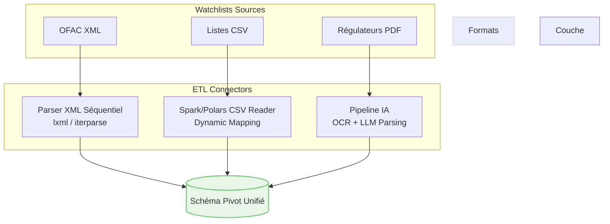
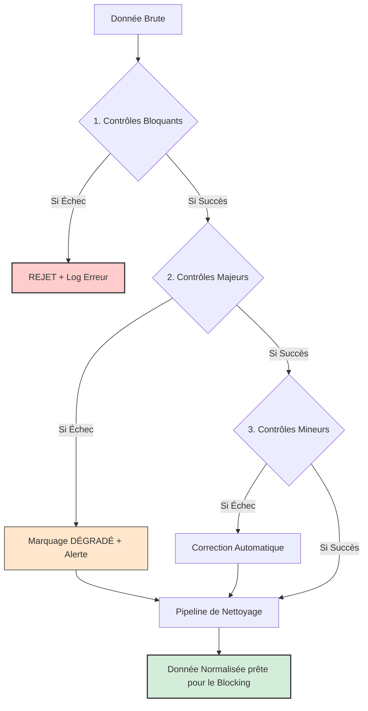
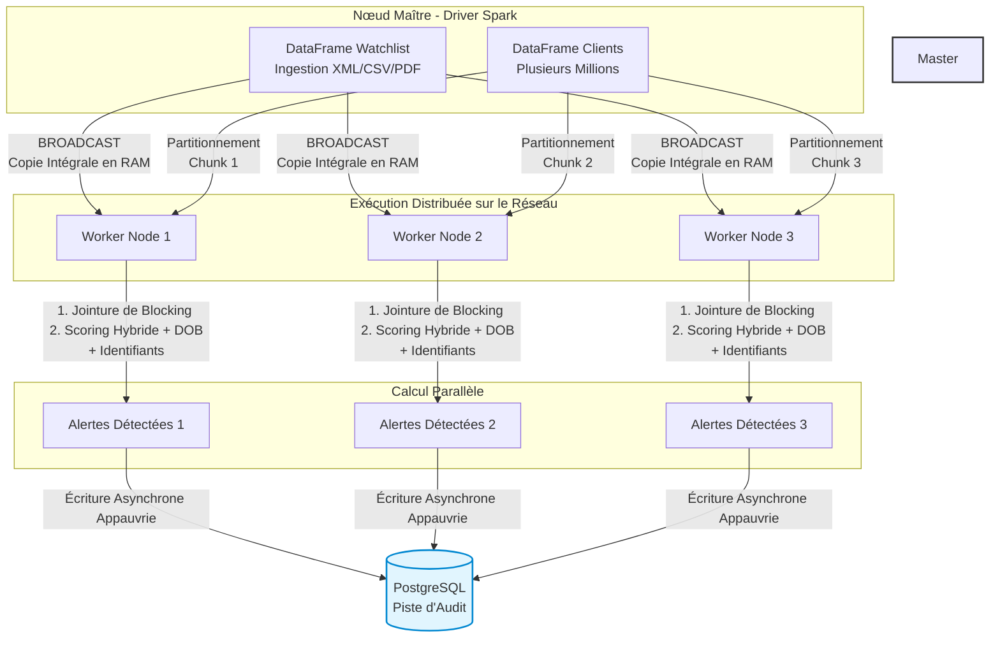

# DOCUMENT D'ARCHITECTURE TECHNIQUE (DAT)
## Système de Criblage et Filtrage de Sanctions / PEP à Haute Volumétrie
**Version :** 1.0 (Statut : Final pour POC/Industrialisation)  
**Date :** Juin 2026  
**Domaine :** Conformité Bancaire / LBA-CFT  

---

## 1. Introduction et Objectifs

### 1.1 Contexte
Le présent document définit l'architecture technique d'un moteur de criblage (Screening Engine) de nouvelle génération destiné aux institutions financières. L'outil permet de confronter le référentiel tiers (Clients, Mandataires, Bénéficiaires Effectifs) aux listes de sanctions et de Personnes Politiquement Exposées (PEP) fournies par des éditeurs officiels ou étatiques (OFAC, UE, ONU, Dow Jones, World-Check).

### 1.2 Objectifs de Performance et Scalabilité
* **Mode Temps Réel :** Analyse unitaire d'un profil lors de l'entrée en relation (KYC) ou d'une transaction avec une latence cible <= 200ms.
* **Mode Batch :** Analyse de masse (initialisation, deltas quotidiens, purges) capable d'absorber des dizaines de millions de lignes via une architecture distribuée Apache Spark, avec un débit cible >= 50 000 profils par minute.

---

## 2. Modèle de Données et Ingestion (Mise à jour)

### 2.1 Schéma Pivot de l'Entité Listée (Watchlist)
Le schéma intègre désormais les spécificités de filtrage avancées (Vessels, Juridictions, Successions) :
* entity_id : STRING (Unique)
* entity_type : STRING (I = Individual, E = Entity, V = Vessel, O = Other)
* primary_name : STRING (Nom complet brut pour les PM/Vessels/Other)
* individual_name_parsed : OBJECT (Pour entity_type = I)
    * first_name : STRING
    * last_name : STRING
    * maiden_name : STRING (Nom de jeune fille)
* aliases : ARRAY OF STRINGS
* dates_of_birth : ARRAY OF STRINGS (YYYY-MM-DD)
* date_of_death : STRING (YYYY-MM-DD / NULL)
* is_deceased : BOOLEAN (True / False)
* gender : STRING (M / F / U - Attribut unique strict)
* countries : OBJECT
    * citizenship : ARRAY OF ISO2
    * residence : ARRAY OF ISO2
    * birth_country : ARRAY OF ISO2
    * jurisdiction_country : ARRAY OF ISO2 (Pour les entités, navires ou structures juridiques)

### 2.2 Schéma Référentiel Client (Alignement de Matching)
Pour s'aligner avec la granularité des listes fournisseurs et maximiser les chances de hit, le modèle client est enrichi de colonnes miroirs :
* client_id : STRING (Unique)
* client_type : STRING (PP = Personne Physique, PM = Personne Morale)
* client_first_name : STRING (Pour PP)
* client_last_name : STRING (Pour PP)
* client_maiden_name : STRING (Pour PP - Permet de matcher avec le Maiden Name de la Watchlist)
* client_company_name : STRING (Pour PM)
* client_dob : STRING (YYYY-MM-DD)
* client_gender : STRING (M / F / U)
* client_is_deceased : BOOLEAN (Par défaut False - Permet de nettoyer ou d'atténuer les alertes sur les successions)
* client_countries : OBJECT
    * nationality : ARRAY OF ISO2
    * residence : ARRAY OF ISO2
    * birth_country : ARRAY OF ISO2
    * registration_country : ARRAY OF ISO2 (Pays d'immatriculation / juridiction pour les PM)

### 2.3 Éléments d'Identifications et Moyens de Transport (Mise à jour)
Pour éliminer de manière définitive le risque d'homonymie, le système ingère et sépare de manière stricte les identifiants uniques des personnes physiques, des personnes morales et des moyens de transport.

* Côté Watchlist :
    * imo_number : STRING (Identifiant maritime unique - 7 chiffres - pour entity_type = V)
    * aircraft_tail_number : STRING (Immatriculation aéronautique pour entity_type = V/O)
    * lei_number : STRING (Legal Entity Identifier à 20 caractères pour entity_type = E)
    * national_registry_ids : ARRAY OF OBJECTS [number, country, registry_name] (SIREN, EIN...)
    * other_registration_ids : ARRAY OF OBJECTS [id_type, number]
    * passport_documents : ARRAY OF OBJECTS [number, issuing_country, expiration_date] (Pour entity_type = I)
    * national_id_documents : ARRAY OF OBJECTS [number, issuing_country] (Pour entity_type = I)
    * other_id_documents : ARRAY OF OBJECTS [doc_type, number, issuing_country] (Pour entity_type = I)

* Côté Client & Transactions :
    * transaction_vessel_imo : STRING (Numéro IMO extrait des documents de transport / Trade Finance)
    * transaction_aircraft_registration : STRING (Immatriculation aéronef extraite du fret aérien)
    * client_lei_number : STRING (Numéro LEI du client corporate)
    * client_national_registry_ids : ARRAY OF OBJECTS [number, country, registry_name] (SIREN/CNI entreprise)
    * client_other_registration_ids : ARRAY OF OBJECTS [id_type, number]
    * client_passport_documents : ARRAY OF OBJECTS [number, issuing_country, expiration_date]
    * client_national_id_documents : ARRAY OF OBJECTS [number, issuing_country]
    * client_other_id_documents : ARRAY OF OBJECTS [doc_type, number, issuing_country]

### 2.4 Spécifications Techniques des Connecteurs d'Entrée (Ingestion Connectors)

Le module d'ingestion doit être capable d'absorber les watchlists via trois pipelines distincts selon le format du fournisseur :

#### A. Le Connecteur XML (Spécifique OFAC Advanced XML)
Les fichiers XML de l'OFAC sont hautement structurés mais volumineux. Le développeur ne doit pas charger le XML intégralement en mémoire (interdiction d'utiliser `minidom` ou `BeautifulSoup` en mode Batch pour éviter les crashs de RAM).
* **Technologie requise :** Utilisation d'un parseur d'événements séquentiel type **LXML / ElementTree (Iterparse)** en Python ou un parseur StAX en Java/Go.
* **Logique de mapping :** Le script doit écouter les balises clés :
    * `<sanctionsForm>` pour identifier le type d'entité (I, E, V).
    * `<idRegistrationDoc>` pour mapper directement vers nos champs éclatés `passport_documents` ou `lei_number`.
    * `<feature>` avec une valeur `Cycle` pour extraire les dates de naissance (Multi-DOB).

#### B. Le Connecteur CSV / Délimité
Le format le plus simple et le plus rapide à ingérer en masse.
* **Technologie requise :** Ingestion directe via un connecteur **Apache Spark CSV Reader** (ou `Polars.read_csv` en local).
* **Contrainte technique :** Le fichier de configuration `config.yaml` doit permettre de définir le caractère délimiteur (`,`, `;` ou `\t`) et le dictionnaire de mapping des colonnes pour s'adapter aux fichiers de n'importe quel fournisseur secondaire.

#### C. Le Connecteur PDF Inteliggent (Publications Européennes & Avis Urgents)
Les publications de l'Union européenne (au Journal Officiel) ou les gels d'avoirs d'urgence (DGT/Trésor en France) prennent souvent la forme de fichiers PDF textuels ou scannés. Comme ces documents n'ont pas de structure informatique fixe, l'outil doit intégrer un pipeline d'extraction par **Intelligence Artificielle (Document Parsing / LLM)**.

Le pipeline PDF doit suivre strictement ces 3 étapes :
1. **Extraction Textuelle / OCR :** Utilisation de la librairie `pypdf` ou `pdfplumber` pour extraire le texte brut. Si le PDF est une image (scan), le moteur doit déclencher un module d'OCR (type `Tesseract` ou une API Cloud de Vision).
2. **Extraction d'Entités Nommées (NER - Named Entity Recognition) :** Le texte brut est envoyé à un modèle de langage (LLM local type *Llama 3 / Mistral* optimisé ou une API souveraine). Le prompt du LLM est verrouillé pour extraire **uniquement** les données correspondant à notre schéma pivot au format JSON.
3. **Validation de Schéma :** Le JSON généré par l'IA est validé par une couche de contrôle (ex: `Pydantic` en Python) pour vérifier qu'aucune donnée aberrante n'est injectée, avant d'envoyer les profils extraits vers le moteur de criblage Spark.


---

## 3. Module 1 : Nouvelles Matrices de Sévérité des Anomalies

Avec l'introduction de ces nouveaux champs critiques, le Data Quality Gate est durci pour classifier les incohérences de structure.

### 3.1 Erreurs Bloquantes (CRITICAL / REJECT)
* L'anomalie stoppe immédiatement le processus pour la ligne concernée.

* Rule_B01 (Champ Nom Principal Vide) : primary_name ou client_last_name est absent ou NULL.
* Rule_B02 (Type d'Entité Invalide ou Incohérent) : 
    * Côté Watchlist : Le type n'est pas dans (I, E, V, O).
    * Côté Client : Le type n'est pas dans (PP, PM).
* Rule_B04 (Incohérence Nom/Structure Individu) : L'entité est de type "I" (Individual) ou "PP" mais les champs first_name et last_name sont tous les deux impossibles à extraire ou vides après parsing.
* Rule_B05 (Longueur Nom Insuffisante) : Le nom nettoyé fait moins de 2 caractères (ex: "X").
* Rule_B06 (Structure XML Corrompue - BLOQUANT) : Le fichier XML de l'OFAC est mal formé (balise non fermée, corruption de transfert). Le processus d'ingestion s'arrête immédiatement pour protéger l'intégrité de la base.

### 3.2 Erreurs Majeures (WARNING / DEGRADED)
* La donnée est dégradée. Le criblage a lieu mais la ligne est tagguée "DÉGRADÉE" avec obligation de remonter une alerte de qualité aux équipes IT/Data.

* Rule_M01 (Absence totale de Géographie) : Aucun pays (Résidence, Nationalité, Naissance, Juridiction) n'est renseigné des deux côtés.
* Rule_M02 (Absence d'identifiant d'âge/existence) : Pour un individu vivant, pas de Date de Naissance (DOB).
* Rule_M04 (Contradiction Statut Vital Prémédité) : Le champ date_of_death est renseigné mais is_deceased est à "False" (Incohérence logique fournisseur). L'outil force is_deceased = True automatiquement pour le scoring mais lève l'anomalie.
* Rule_M05 (Format Date Invalide) : Une date (DOB, Death) ne respecte pas le standard strict YYYY-MM-DD (ex: "1975/12/02" ou "1980"). Le moteur extrait l'année pour le blocking "best-effort" mais dégrade la note de qualité.
* Rule_M06 (Format Numéro Passeport Suspect) : Si un numéro de passeport (client ou watchlist) contient des caractères spéciaux interdits (ex: espaces internes, tirets mal placés, symboles) ou si sa longueur est aberrante (ex: moins de 4 caractères), le système nettoie les caractères non alphanumériques pour le matching, mais marque la ligne comme DÉGRADÉE.
* Rule_M07 (Structure LEI Invalide) : Si le champ client_lei_number ou lei_number est renseigné mais ne respecte pas le standard strict de l'ISO 17442 (longueur de 20 caractères, structure alphanumérique), l'outil l'exclut du mécanisme de Hard Match direct (Priorité 1) pour éviter un faux sentiment de sécurité, et bascule la ligne en statut DÉGRADÉ pour forcer le fuzzy matching textuel à prendre le relais.
* Rule_M08 (Échec d'Extraction de Confiance PDF - MAJEUR) : Le module IA/LLM a extrait des données d'un PDF de sanction mais le score de confiance (Confidence Score) du modèle est inférieur à 85%, ou des champs indispensables comme le nom n'ont pas pu être isolés de manière certaine. La ligne est intégrée mais marquée comme DÉGRADÉE pour forcer une revue humaine de la watchlist par un administrateur.

### 3.3 Erreurs Mineures (INFO / AUTO-CLEAN)
* Anomalies de formatage corrigées automatiquement par l'outil sans impact sur le statut de criblage.

* Rule_I01 (Espaces multiples ou Consécutifs) : Corrigé en espace simple.
* Rule_I02 (Caractères Spéciaux de Saisie) : Suppression des points, tirets bas ou symboles isolés (ex: "Jean_Pierre" -> "JEAN PIERRE").
* Rule_I03 (Incohérence de Genre Multi-valué) : Si un flux client ou fournisseur envoie plusieurs genres pour une ligne (ex: ["M", "F"]), l'outil applique une règle de repli unitaire obligatoire : genre = "U" (Unknown) pour éviter le plantage du moteur strict.

### 3.2 Pipeline de Nettoyage Textuel (Cleansing)
Le traitement s'exécute séquentiellement :
1. Passage en Majuscules : Uniformisation de la casse.
2. Aplatissement ASCII (Stripping) : Suppression des accents et diacritiques (ex: Müller -> MULLER). Note : L'affichage UI peut conserver l'accent, le moteur calcule sans accent.
3. Suppression des "Noise Words" (Pour les PM uniquement) : Nettoyage des suffixes légaux via Regex insensibles à la casse : \b(SA|SARL|LLC|LTD|GMBH|SOCIETE)\b -> "".



---

## 4. Module 2 : Moteur de Blocking Personnalisable (Custom Blocking Engine)

Pour éviter le piège algorithmique du produit cartésien, le moteur utilise un mécanisme de partitionnement dynamique. La banque configure sa propre clé de bloc dans le fichier de configuration global.

### 4.1 Configuration de la Clé Dynamique (config.yaml)
L'administrateur système peut composer la clé en chaînant des variables métiers :

blocking:
  strategy: "standard_performance"
  custom_key_layout: ["COUNTRY_ISO", "ENTITY_TYPE", "PHONETIC_FIRST"]

### 4.2 Algorithme de Blocking
* PHONETIC_FIRST : Implémentation du code Double Metaphone sur le premier mot du jeton de nom (ex: MULLER ou MELLER -> MLR).
* Mécanisme de Secours (Fallback) : Si un attribut de la clé personnalisée est manquant chez le client (ex: pas de pays), le moteur bascule automatiquement sur une valeur générique XX pour éviter tout phénomène d'omission de filtrage.

---

## 5. Module 3 : Moteur de Scoring et Combinaisons Algorithmiques

### 5.1 Algorithmes Textuels Hybrides (Poids)
Le score de base textuelle (S_base) est calculé sur une échelle de 0 à 100 via la formule pondérée suivante :
S_base = (0.4 * JW) + (0.4 * DL) + (0.2 * TS)

* Jaro-Winkler (JW) : Sensible aux fautes de frappe et d'orthographe en début de chaîne.
* Damerau-Levenshtein (DL) : Détecte les inversions de lettres adjacentes, les ajouts et les omissions.
* Token Sort (TS) : Résout les inversions structurelles (ex: PUTIN Vladimir vs Vladimir PUTIN) en triant les composants de manière alphanumérique avant calcul.

### 5.2 Règle de la Correspondance Maximale (Gestion Multi-DOB & Multi-Pays)
Lorsque les entités des listes de sanctions présentent des attributs multiples, le moteur applique la règle du Best-Match : le score final retenu est le score le plus élevé parmi l'ensemble des combinaisons testées sur la ligne.

### 5.3 Matrice d'Ajustement Contextuel (Bonus / Malus)
Après l'obtention du S_base, des règles métiers modifient le score, bridé structurellement entre [0, 100] :
Score Final = Brider(S_base + Somme(Bonus/Malus))

* Date de Naissance (DOB) :
    * Match exact (Jour/Mois/Année) -> +15 points
    * Écart inférieur ou égal à la fenêtre réglable dob_tolerance_window (ex: <= 2 ans) -> +5 points
    * Écart strictement supérieur à la fenêtre réglable -> -15 points
* Genre (Gender) :
    * Si spécifié et contradictoire (ex: Homme vs Femme) -> -20 points (Discriminateur majeur).
* Géographie (Pays) :
    * Si le pays du client correspond à au moins l'un des pays de la fiche (Résidence, Nationalité, Naissance) -> +10 points
    * Si aucun point de contact géographique n'est trouvé -> -10 points

### 5.4 Seuil de Coupure Réglementaire (Cut-off)
Le seuil absolu de génération d'alerte est fixé à 75%. 
* Score Final >= 75% -> Statut : ALERT (Gel de la transaction / Soumission à l'analyse humaine).
* Score Final < 75% -> Statut : NO_MATCH (Fermeture automatique de la piste).

### 5.5 Règle de Priorité Absolue : Le Match sur Identifiant et Match Parfait (Short-Circuit Logic)

Avant d'initier la formule de scoring textuel flou (Fuzzy Matching) basée sur les coefficients pondérés (Section 5.1), le moteur (Spark en mode Batch ou API en Temps Réel) exécute une séquence de vérification stricte. Si l'une des correspondances exactes suivantes est validée, **le calcul s'arrête immédiatement pour cette paire** : le SCORE FINAL est verrouillé à 100% et l'entité passe au statut ALERT.

L'ordre séquentiel d'exécution des contrôles de court-circuit est le suivant :

1. **Priorité 1 : Le Numéro LEI (Personnes Morales - International)**
    * *Condition :* Si (`client_lei_number == watchlist.lei_number`) et que le champ n'est pas NULL.

2. **Priorité 2 : Le Passeport (Personnes Physiques - International)**
    * *Condition :* Si (`client_passport_documents.number == watchlist.passport_documents.number`) ET (`issuing_country` identique).

3. **Priorité 3 : Les Registres Nationaux d'Entreprises (National Registry IDs)**
    * *Condition :* Si un numéro du tableau `client_national_registry_ids` correspond exactement à un numéro du tableau `watchlist.national_registry_ids` ET que le pays (`country`) est identique.

4. **Priorité 4 : Les Cartes Nationales d'Identité (National ID)**
    * *Condition :* Si (`client_national_id_documents.number == watchlist.national_id_documents.number`) ET (`issuing_country` identique).

5. **Priorité 5 : Le Match Parfait Prénom / Nom (Exact Name Match - NOUVEAU)**
    * *Condition (Personnes Physiques) :* Si (`client_last_name == watchlist.individual_name_parsed.last_name`) ET (`client_first_name == watchlist.individual_name_parsed.first_name`).
    * *Condition sur Alias (High Priority) :* La règle s'applique également si le couple Prénom/Nom du client matche parfaitement avec les composants d'un alias classé en `high_priority` (Section 5.6).
    * *Note technique :* Cette vérification s'accentue sur les chaînes de caractères **normalisées** (majuscules, sans accents, sans espaces multiples) issues du module de nettoyage (Section 3.2).

6. **Priorité 6 : Les Moyens de Transport (Navires / Avions)**
    * *Condition :* Match exact sur `transaction_vessel_imo` ou `transaction_aircraft_registration`.

7. **Priorité 7 : Les Autres Documents et Identifiants (Other IDs / Other Registrations)**
    * *Condition :* Match exact sur le numéro et le type de document (`doc_type` ou `id_type`).

```python
def evaluate_exact_name_match(client_first, client_last, watchlist_first, watchlist_last):
    # Comparaison stricte des chaînes nettoyées et standardisées
    if client_last == watchlist_last and client_first == watchlist_first:
        return {
            "final_score": 100.0,
            "decision": "ALERT",
            "reason": "Exact Name Match: First name and Last name match perfectly (Priority 5)."
        }
    return None
```

### 5.6 Filtrage Segmenté des Alias par Niveau de Criticité (Alias Risk Categorization)

Afin d'éviter la saturation du moteur de scoring par des faux positifs industriels tout en maintenant une sécurité maximale, les alias de l'entité listée doivent être catégorisés dynamiquement lors de l'ingestion en deux niveaux : **High** (Actif pour le criblage) et **Low** (Exclu du criblage).

#### A. Rangs de Classification (Logic Target)
* **HIGH (Criblé / Filtré) :** L'alias possède une structure complète (Nom + Prénom ou Raison sociale claire). Il passe obligatoirement dans la pipeline complète : *Blocking* (Section 4) et *Scoring Hybride* (Section 5.1).
* **LOW (Pas criblé / Pas filtré) :** L'alias est un surnom, un terme trop générique, ou un fragment de nom. Il est stocké dans la base pour la consultation humaine (Audit Trail) mais le moteur Spark/API l'ignore lors des calculs en temps réel ou batch.

#### B. Règles de Qualification Automatique (Ingestion Layer)
Le développeur doit implémenter un filtre automatique basé sur l'attribut d'origine du fournisseur ou une règle structurelle par défaut :

1. **Via les attributs natifs du fournisseur (ex: OFAC Advanced XML) :**
    * Si l'attribut `AliasType` de l'élément `<Alias>` est égal à `Strong` (ou code ID correspondant) -> Catégorie **HIGH**.
    * Si l'attribut `AliasType` est égal à `Weak` -> Catégorie **LOW**.

2. **Via l'analyseur structurel de secours (Fallback Heuristic) :**
    Si la liste source ne qualifie pas la force de l'alias, le module de diagnostic (Section 3) applique la règle structurelle suivante :
    * **Règle :** Un alias passe en catégorie **LOW** si le jeton textuel nettoyé répond à l'une de ces conditions :
        * Il ne contient qu'un seul mot (ex: "PILOTE", "ALEX").
        * Sa longueur totale est inférieure ou égale à 4 caractères (ex: "M_R").
        * Il est composé uniquement de termes de la liste des mots à exclure (*Noise Words* génériques).

#### C. Traduction dans le Schéma Pivot de la Watchlist (Section 2.1)
Le tableau plat `aliases` est restructuré pour isoler les flux de calcul :

```json
"aliases": {
  "high_priority": ["ARRAY OF STRINGS (Actifs pour le Fuzzy Matching)"],
  "low_priority": ["ARRAY OF STRINGS (Persistés uniquement pour affichage/audit)"]
}
```

---

## 6. Architecture Applicative et Déploiement

### 6.1 Mode Temps Réel (Onboarding & Flux)
* Composant : API asynchrone hautes performances écrite en Go (Golang) ou FastAPI.
* Infrastructure : Chargement intégral des listes indexées par blocs en RAM (In-Memory Cache) au démarrage du service. Aucune interrogation disque en cours de criblage.

### 6.2 Mode Batch sous Apache Spark (Traitement de Masse)

Le mode Batch est conçu pour traiter de très fortes volumétries de données (initialisation du référentiel client, deltas quotidiens des watchlists, ou purges réglementaires de masse). Pour garantir une scalabilité horizontale (*Scale-Out*), ce module est nativement développé pour s'exécuter sur un cluster **Apache Spark**.

#### A. Stratégie d'Optimisation : Le Broadcast Join
Le criblage de masse souffre traditionnellement du problème de produit cartésien ($O(N \times M)$), où chaque client doit être comparé à chaque ligne de sanction. 
Pour optimiser radicalement les performances et éviter les déplacements de données sur le réseau (*Data Shuffling*), le moteur utilise la stratégie du **Broadcast Join** :
1. La base de données des watchlists ( Schéma Pivot unifié, ~1 à 2 millions de lignes) est considérée comme "petite" à l'échelle du Big Data. Elle est envoyée et clonée en mémoire vive (RAM) sur l'intégralité des nœuds de calcul du cluster (*Worker Nodes*).
2. Le DataFrame des clients de la banque (plusieurs dizaines de millions de lignes) est partitionné et distribué sur les différents nœuds.
3. Chaque *Worker Node* exécute ainsi ses calculs de jointure et de scoring localement, de manière 100% parallèle et isolée.

#### B. Logique d'Exécution de la Pipeline Spark
L'exécution du traitement distribué suit strictement trois phases séquentielles :
1. **Étape 1 : La Jointure de Blocking Exacte.** Les DataFrames `client` et `watchlist` (diffusé par Broadcast) sont joints via une condition stricte sur la clé de bloc personnalisée (`on="blocking_key"`). Cette opération élimine immédiatement plus de 98% des comparaisons inutiles.
2. **Étape 2 : Le Hard Match Séquentiel (Priorité Absolue).** Sur les candidats restants, Spark évalue les jointures directes sur les identifiants éclatés (LEI, Passeports, CNI, IMO, Aircraft). Si un match exact est trouvé, le score est forcé à `100.0` et les calculs s'arrêtent pour cette paire.
3. **Étape 3 : Le Scoring Hybride Distribué (UDF).** Pour les lignes n'ayant pas déclenché de Hard Match, Spark exécute une fonction utilisateur personnalisée (UDF) qui applique la formule de scoring textuelle floue (Jaro-Winkler, Levenshtein, Token Sort) en itérant **uniquement** sur le `primary_name` et le sous-tableau `aliases.high_priority`. Les alias classés en `low_priority` sont ignorés du calcul. L'UDF applique ensuite les règles de bonus/malus contextuels (Multi-DOB avec fenêtre de tolérance dynamique, Genre unitaire, Pays multiples).

#### C. Implémentation PySpark Réelle pour le Développeur

Le script de soumission Spark (*Spark Job*) doit implémenter la logique distribuée suivante :

```python
from pyspark.sql import functions as F
from pyspark.sql.types import StructType, StructField, FloatType, StringType, BooleanType

# 1. Définition du schéma de sortie attendu pour l'UDF de Scoring Évolué
scoring_output_schema = StructType([
    StructField("final_score", FloatType(), False),
    StructField("decision", StringType(), False),
    StructField("audit_trail_json", StringType(), False)
])

# 2. Déclaration de l'UDF Spark (Idéalement packagée avec des liaisons C++/Rust pour la vitesse)
# Cette fonction encapsule la logique des Sections 5, 5.2 (Multi-DOB), 5.5 (Hard Match) et 5.6 (Alias High)
evaluate_compliance_udf = F.udf(my_enterprise_scoring_engine, scoring_output_schema)

def run_spark_batch_screening(client_df, watchlist_df, config):
    """
    Contrôle de conformité de masse parallélisé sur Cluster Apache Spark
    """
    
    # Récupération des variables dynamiques de configuration (config.yaml)
    dob_window = config["scoring"]["contextual_rules"]["dob_tolerance_window"]
    cutoff_threshold = config["scoring"]["cutoff_threshold"] # Fixé à 75.0
    
    # PHASE 1 : Broadcast Join basé sur la clé de block custom (Section 4)
    # Élimine instantanément le produit cartésien global
    candidates_df = client_df.join(
        F.broadcast(watchlist_df),
        on="blocking_key",
        how="inner"
    )
    
    # PHASE 2 & 3 : Évaluation distribuée (Hard Match + Fuzzy Match + Contextuel)
    # L'UDF reçoit l'ensemble des structures éclatées et multi-valuées
    scored_df = candidates_df.withColumn(
        "screening_result",
        evaluate_compliance_udf(
            # Noms (Principal + Alias Filtrés)
            F.col("client_first_name"), F.col("client_last_name"), 
            F.col("watchlist_primary_name"), F.col("watchlist_aliases_high_priority"),
            # Identités éclatées (Pour le Hard Match)
            F.col("client_passport_documents"), F.col("watchlist_passport_documents"),
            F.col("client_national_id_documents"), F.col("watchlist_national_id_documents"),
            # Entreprises & Transports éclatés
            F.col("client_lei_number"), F.col("watchlist_lei_number"),
            F.col("client_national_registry_ids"), F.col("watchlist_national_registry_ids"),
            F.col("transaction_vessel_imo"), F.col("watchlist_imo_number"),
            # Attributs contextuels multiples
            F.col("client_dob"), F.col("watchlist_dates_of_birth"), 
            F.col("client_gender"), F.col("watchlist_gender"),
            F.col("client_countries"), F.col("watchlist_countries"),
            # Paramètres configurables
            F.literal(dob_window)
        )
    )
    
    # Extraction des champs de la structure de l'UDF pour la mise à plat
    final_df = scored_df.withColumn("final_score", F.col("screening_result.final_score")) \
                        .withColumn("decision", F.col("screening_result.decision")) \
                        .withColumn("audit_trail", F.col("screening_result.audit_trail_json"))
    
    # PHASE 4 : Filtrage strict selon le seuil réglementaire de coupure (75%)
    # Seules les alertes avérées sont isolées pour la persistance
    alerts_df = final_df.filter(F.col("final_score") >= F.literal(cutoff_threshold))
    
    return alerts_df
```


---

## 7. Piste d'Audit et Explicabilité (Compliance Audit Trail)

Chaque décision logicielle doit pouvoir être reconstruite à des fins de contrôle réglementaire (ACPR/AMF). Le système persiste de manière immuable en base de données relationnelle (PostgreSQL cible) :
1. La version exacte et le hash de la liste de sanctions active au moment du calcul.
2. Le fichier de configuration (config.yaml) complet utilisé le jour du calcul (valeur du seuil à 75%, valeur de la tolérance DOB à 2 ans, etc.).
3. L'arbre de décision expliquant mathématiquement la note finale (Score textuel d'origine + le détail linéaire des bonus/malus appliqués).

---

## 8. SECTION 8 : Gestion de l'Historique et Moteur de Comparaison (Versioning & Delta Engine)

### 8.1 Objectif du module
Ce module gère le cycle de vie, la traçabilité et l'auditabilité de toutes les watchlists et référentiels clients injectés dans le système. Il permet de conserver un historique complet des versions et fournit un moteur d'analyse différentielle (Delta) capable de comparer deux versions d'un même type de fichier pour en extraire les écarts structurels.

### 8.2 Architecture du Versioning (Snapshotting)
Chaque fichier (Watchlist XML/CSV ou Base Client CSV) importé dans le système est considéré comme un **Instantané (Snapshot)** immuable. 
Le système génère une table de métadonnées d'historique structurée comme suit :

* snapshot_id : STRING (UUID unique généré à l'import)
* file_type : STRING (WATCHLIST_OFAC, WATCHLIST_EU, CLIENT_BASE)
* file_name : STRING (Nom d'origine du fichier)
* file_hash : STRING (Empreinte SHA-256 du fichier physique pour garantir l'intégrité)
* record_count : INTEGER (Nombre total d'entités chargées)
* uploaded_at : TIMESTAMP (Date et heure de l'import)
* status : STRING (PROCESSING, READY, SUPERSEDED, ERROR)

---

### 8.3 Moteur de Comparaison Différentielle (Delta Engine)

Le moteur de comparaison prend en entrée deux identifiants de snapshots (`snapshot_old` et `snapshot_new`) du même `file_type`. Il procède à une analyse d'écart bidirectionnelle en exploitant les identifiants uniques durs (`entity_id` pour les listés, `client_id` pour les clients).

Le résultat de la comparaison classe les lignes selon trois statuts stricts :

1. **ADDED (Ajouté) :** L'identifiant est présent dans le nouveau snapshot mais absent de l'ancien.
2. **REMOVED (Supprimé) :** L'identifiant est présent dans l'ancien snapshot mais absent du nouveau.
3. **MODIFIED (Modifié) :** L'identifiant est présent dans les deux fichiers, mais une ou plusieurs colonnes/attributs ont changé.

#### Logique d'optimisation pour Apache Spark (Mode Batch Delta)
Pour comparer des fichiers clients contenant des dizaines de millions de lignes sans saturer le cluster, Spark exécute un `FULL OUTER JOIN` basé sur l'identifiant unique :

```python
def calculate_dataframe_delta(df_old, df_new, id_column):
    """
    Calcule le delta complet entre deux snapshots de masse sous Apache Spark
    """
    # 1. Full Outer Join sur l'identifiant unique
    joined_df = df_old.withColumnRenamed("file_hash", "old_hash").alias("old") \
                      .join(df_new.withColumnRenamed("file_hash", "new_hash").alias("new"), 
                            on=id_column, 
                            how="full_outer")
    
    # 2. Identification des Ajouts et des Suppressions
    delta_df = joined_df.withColumn(
        "delta_status",
        F.when(F.col(f"old.{id_column}").isNull(), "ADDED") \
         .when(F.col(f"new.{id_column}").isNull(), "REMOVED") \
         .otherwise(F.when(F.col("old.entity_checksum") != F.col("new.entity_checksum"), "MODIFIED") \
                     .otherwise("UNCHANGED"))
    )
    
    # 3. Filtrage pour ne conserver que les lignes d'écarts
    result_delta_df = delta_df.filter(F.col("delta_status") != "UNCHANGED")
    
    return result_delta_df
```

Note technique : Pour optimiser l'étape MODIFIED, le module d'ingestion calcule lors du chargement un entity_checksum (un hash MD5/SHA1 de concaténation de tous les champs de la ligne). Si les deux ID correspondent mais que les checksums diffèrent, la ligne est marquée MODIFIED instantanément sans faire de comparaison colonne par colonne.

### 8.4 Structure du Rapport de Différence (Spécification JSON de Sortie)

Qu'il s'agisse d'une exécution Temps Réel (via l'API /api/compare de votre serveur) ou d'un rapport de masse Spark, l'outil doit retourner un bilan structuré indiquant le résumé volumétrique et le détail des modifications (champs Before / After) :

```json
{
  "comparison_metadata": {
    "file_type": "WATCHLIST_OFAC",
    "old_snapshot_id": "snap-2026-06-01",
    "new_snapshot_id": "snap-2026-06-15",
    "execution_timestamp": "2026-06-16T01:17:23Z"
  },
  "summary": {
    "added_count": 142,
    "removed_count": 35,
    "modified_count": 88
  },
  "details": {
    "added": [
      { "id": "OFAC-99412", "primary_name": "AL-MANSOUR SHIPPING", "type": "E" }
    ],
    "removed": [
      { "id": "OFAC-11204", "primary_name": "SMITH JOHN", "type": "I" }
    ],
    "modified": [
      {
        "id": "OFAC-55419",
        "primary_name": "MULLER HANS",
        "changes_detected": ["dates_of_birth", "countries.residence"],
        "before": {
          "dates_of_birth": ["1975-12-15"],
          "countries": { "residence": ["DE"] }
        },
        "after": {
          "dates_of_birth": ["1975-12-15", "1975-12-16"],
          "countries": { "residence": ["FR"] }
        }
      }
    ]
  }
}
```